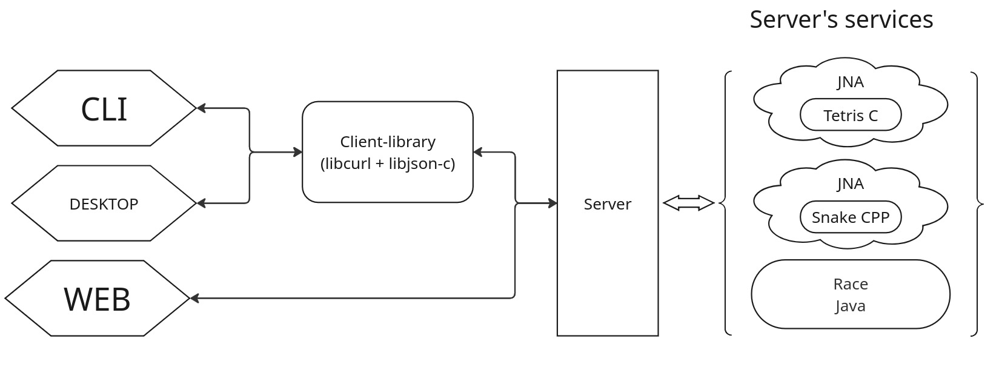

# REST-API service for BrickGame series


## Description:

The project is supposed to expand the existing series of games - the Race should be added to Tetris and Snake.\
All games should be accessible via a web interface.\
Also, Race should be accessible in a console interface written in C and a desktop interface written in C++

---

Games are services (in Spring application terminology). Race is connected to the server "directly", snake and tetris via the JNA mechanism.

Access from the console and desktop interface is provided by a small client library written in C, which encapsulates calls to the server and parsing of JSON into C structures.



## Install
Project contains C/C++ code, so ```gcc``` and ```g++``` must be installed

### For web-interface only:
```cd src/brick_game/server && gradle bootRun```\
Games will be accessible at http://localhost:8080

### Building console interface:
```cd src/gui/cli && make```\
(```ncurses```, ```libcurl``` and ```libjson-c``` must be installed)\
Run ```s21_cli``` after server started

### Building desktop interface:
```cd src/gui/desktop && make```\
(```Qt6```, ```libcurl``` and ```libjson-c``` must be installed)\
Run ```s21_desktop``` after server started
